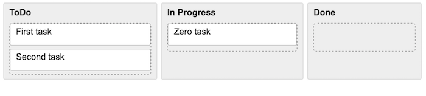

# React drag and drop components

Drag and drop solution for react in different model environments



## Getting started

Install

```
$ npm i
```

Run local server and watch file changes

```
$ npm start
```

Open [localhost:8080](http://localhost:8080/)

## How to use

Since React can be used with different models - Flux, Redux, etc - I can't build solution that will fit for all of them.
Therefore I decided to build components wrap with API that will provide data about dragged elements and user will decide how to use it.

In this repository you can find working example with React and Redux, but you can build similar solution with Flux or any other model of your choise.

**`<DragItemsContainer>`**

Container that hold dragging elements

**`<DragItem>`**

Draggable element

